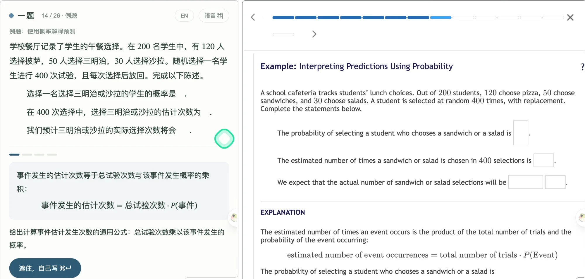

# 一题 · 跟着 Math Academy 学的中文陪练

一题是 [Math Academy](https://www.mathacademy.com) 的本地陪练工具，给用中文思考的学生用。它跟着你在 Math Academy 上正在看的那一步走：把英文翻成中文，给你这一步背后的**前置知识**（更基础的概念、方法、公式，每一项都可以进一步展开），并且随时可以**问一问**。卡住时也可以开语音问陪练。

它守一条线：**练习题交答案之前，不帮你解这道题。** Math Academy 根据你自己交的答案安排练习和复习；先被别人讲会了再交，它就会以为你已经掌握了。所以交答案之前，一题只翻译题目，最多用别的例子帮你补前置知识。交了之后（对错都行），再陪你把这道题弄懂。



> 这是个人学习用的非官方工具，和 Math Academy 没有关联。扩展只在你自己的浏览器里读你自己打开的页面，内容只发到你本机运行的一题。

## 两种用法

- **浏览器插件版（推荐）**：装一个 Edge / Chrome 插件，一题就在浏览器侧边栏里跟着 Math Academy 走。不用装 Node，不用命令行；所有模型都由插件直接调用，不经过任何服务器。见下面「插件版」。
- **本机服务版**：在电脑上跑一个 Node 服务，一题开在单独的标签页里，另装一个只负责读页面的小扩展。适合想改代码的人。

## 插件版

1. 拿到插件：从 [Releases](https://github.com/John15263/yiti/releases) 下载最新的 `yiti-extension-<版本>.zip` 并解压；或者自己构建（需要 Node 24）：`node edge/build.mjs`，生成 `dist/edge/` 文件夹。
2. Edge 打开 `edge://extensions`（Chrome 是 `chrome://extensions`），打开「开发人员模式」，点「加载解压缩的扩展」，选解压出来的文件夹（自己构建的话是 `dist/edge`；**不是**源代码里的 `edge` 文件夹）。
3. 点工具栏上一题的图标，侧边栏打开，会弹出「设置」：填 API key，点「保存并测试」。**在中国大陆，一个阿里云百炼的 key 就够了**：文字选「阿里云百炼（千问）」，语音选「阿里云百炼」，区域选中国大陆，并填上**业务空间 ID**（插件里的语音走 WebRTC，必须用业务空间的专属地址；在百炼控制台右上角能看到）。
4. 打开或刷新 Math Academy 的一节课，侧边栏会跟到你正在看的那一步。还没有 Math Academy 账号的话，点「先看一个示例」，用一题自带的例题把各项功能试一遍。
5. 第一次按 ⌘] 开语音时，如果侧边栏没法直接要麦克风权限，一题会打开一个授权页，在那里允许一次就好。

插件的学习记录和 key 都存在浏览器的插件存储里，只发给你选的服务商。

## 需要什么

- Node.js 24 或更新（不需要 `npm install`，没有第三方依赖）
- Chrome（或其他 Chromium 浏览器）
- 模型的 API key，两部分可以分别选：
  - 文字部分（翻译、前置知识、问一问）：[Gemini](https://aistudio.google.com/apikey)、[DeepSeek](https://platform.deepseek.com)，或阿里云百炼的千问（和语音共用一个百炼 key）。
  - 语音陪练：Gemini Live，或阿里云百炼的 Qwen-Omni-Realtime（中国大陆可用，实测中文讲解很自然）。不配语音也能用，只是没有语音按钮。
  - 在中国大陆，**一个百炼 key 就能跑全套**（文字用千问、语音用 Qwen-Omni），不需要 Google 账号。

## 安装

```sh
git clone https://github.com/John15263/yiti.git
cd yiti
npm start               # 打开 http://127.0.0.1:4318
```

第一次打开会弹出「设置」：选文字和语音各用哪家服务，填上 API key，点「保存并测试」，马上就知道 key 能不能用。key 只存在本机的 `data/settings.json`，页面上只显示末尾四位。以后点右上角「设置」随时改。也可以照 `.env.example` 写 `.env`，网页里的设置优先。

装 Chrome 扩展（一次）：

1. Chrome 打开 `chrome://extensions`，右上角打开「开发者模式」。
2. 点「加载已解压的扩展程序」，选这个仓库里的 `extension` 文件夹。
3. 刷新 Math Academy 的页面。一题的页面会跟到你正在看的那一步。

扩展只在 mathacademy.com 上运行，只读**当前这一步**（页面里预先载入的后面几步不读），只发给本机的 `127.0.0.1:4318`。测验、复习、诊断等不是课的页面，只告诉一题"现在在测验"，不读题目内容。

用 AI Agent（Claude Code、Codex 等）安装的话，让它读 [AGENTS.md](AGENTS.md)。

## 怎么用

把一题和 Math Academy 并排放。界面只有一行顶栏（第几步、中英切换、语音），下面是这一步的内容、一个「前置知识」按钮和「问一问」。讲解、例题、练习题都是这一套。

**中文显示**：默认把每一步翻成中文（题目、选项、讲解、例题，连公式里的文字也翻），公式本身原样保留。顶栏的「EN」切回英文原文，「中」切回来。每一步只翻一次；某一段翻得不完整时，那一段显示原文。

**公式**：Math Academy 原文里的公式照原样显示。模型写的前置知识和回答里，有结构的数学（矩阵、分式、根号等）也会渲染成公式，矩阵的括号会撑到整个矩阵的高度；模型没写对的写法，就显示它原来的 LaTeX。你自己提问时，纯文本就行，矩阵写成 `[[1,2],[3,4]]` 之类都行。

**讲解和例题**：整段原文翻成中文，一次看完，不分块、不遮住、不用默写。看不懂的地方，点「前置知识」看它背后的基础，或者直接问一问。

**练习题**：先在 Math Academy 做完、交答案，答错也没关系。它守一条线：交答案之前，一题不帮你解这道题，只帮你补前置知识。交了之后（对错都行），可以看官方讲解，也可以什么都问，包括这道题怎么做。

**前置知识**：每一步下面有「前置知识」按钮：模型列出这一步背后更基础的概念、方法和公式（3 到 6 项，公式会渲染出来）。它只是参考，不是 Math Academy 的官方清单。
- 讲解和例题：列的是读懂这一步需要、但更早就该学过的基础知识，不含这一步自己教的东西。
- 练习题：列的是做这道题背后更基础的知识；不写这道题怎么做，不含这节课新教的内容，也不会出现选项的原文。
- 每一项旁边有「进一步展开」：模型把这个知识点讲清楚，给一个它自己想的小例子，再说一个常见的误区。展开时模型**看不到题目**，讲的是通用的知识，不联系这道题，也不延伸到这节课新教的内容。
- 练习题交答案之前看过、展开过，都会记下来，和语音问前置知识一起算在"交答案前问过前置知识"里。

**问一问**：每一步最下面有「有疑问？问一问」：随时问，可以问很多轮，不打分，⌘↵ 发送。它记得前面聊过的（最近 12 条）。它看到什么，取决于这一步：
- 讲解和例题：看得到这一步的全文，什么都可以问。
- 练习题，交答案之后：看得到题目、选项、你选的、对错和官方讲解，可以完整地讲，包括这道题怎么做、你哪里想错了、别的选项为什么不对。
- 练习题，交答案之前：**看不到题目**，只看到前置知识清单和这节课在教什么。你可以问基础概念、基础方法，它不知道你在做哪道题，所以即使你把题目贴给它、问它选哪个，它也没法帮你解。

**语音陪练**：顶栏的「语音」或 ⌘] 开始／结束，一律中文讲解，英文原词用英文说。讲解和例题：它讲这一步的道理和里面的英文说法；练习题交答案之前只补前置知识；交答案之后讲这道题。换到下一步，或者练习题交了答案，这次通话自动结束。

## 设置

常用的几项在网页的「设置」里就能改（存在 `data/settings.json`，优先于 `.env`）；其余的写在 `.env` 里，模板和说明见 [.env.example](.env.example)：

| 变量 | 作用 |
|---|---|
| `GEMINI_API_KEY` | 文字部分（默认）和语音陪练 |
| `TEXT_PROVIDER` | 文字部分用 `gemini`（默认）、`deepseek` 还是 `qwen` |
| `DEEPSEEK_API_KEY` | `TEXT_PROVIDER=deepseek` 时需要 |
| `GEMINI_MODEL` / `GEMINI_TRANSLATE_MODEL` | 文字模型；翻译默认用更便宜的 flash-lite |
| `VOICE_PROVIDER` | 语音用 `gemini`（默认）还是 `qwen` |
| `DASHSCOPE_API_KEY` / `DASHSCOPE_REGION` / `DASHSCOPE_WORKSPACE_ID` | `VOICE_PROVIDER=qwen` 时需要；key 按区域分开 |
| `QWEN_REALTIME_MODEL` / `QWEN_VOICE` | Qwen 的实时模型和音色 |
| `YITI_PORT` | 端口，默认 4318（改了要同时改扩展 `manifest.json` 和 `background.js` 里的地址） |

每次模型调用的用量和按官方价格算出的花费记在本地数据库，`/api/usage` 可以查看。用 Gemini 实测一小时大约 $0.1，八成以上是语音。Qwen 语音只记 token 数、不估算金额（它的价格这里没有可靠来源），实际费用看百炼控制台。

## 文件

- `edge/`：浏览器插件版的专用部分：在侧边栏里跑引擎的 `backend.js`、浏览器存储 `store.js`、百炼语音的 WebRTC 连接 `rtc.js`，以及 `build.mjs`（把 `server/` 里能在浏览器跑的模块、`web/` 页面和提示词组装成插件）。
- `extension/`：本机服务版用的小扩展（插件版也用同一份 `extract.js` 读页面）。`extract.js` 在 Math Academy 页面里读当前步骤（公式取 TeX，并用页面自带的 MathJax 转成 MathML），`relay.js` 和 `background.js` 转交给本机。
- `server/`：本机服务，只监听 127.0.0.1。`board.mjs` 跟踪当前步骤和每一步的记录；`teach.mjs` 是翻译，`prereq.mjs` 是前置知识清单和展开，`chat.mjs` 是问一问（练习题交答案前，它看不到题目），`llm.mjs` 选 Gemini、DeepSeek 或千问；`translate.mjs` 保证翻译时公式原样保留；`voice.mjs` 是语音中继（key 只在服务端），`voice-providers.mjs` 把 Gemini Live 和 Qwen-Omni-Realtime 各自的协议翻译成同一组事件。
- `prompts/`：提示词。
- `web/`：页面。公式用浏览器原生 MathML 显示，按白名单重建，不插入原始 HTML；`tex.js` 把模型写的 LaTeX 转成 MathML。
- `data/`：本地数据库和 token，不提交。

```sh
npm test
```

## 许可证

[GNU AGPL-3.0](LICENSE)（或更新版本）。可以自由使用、修改和分发；如果你修改后通过网络向别人提供服务，也要以同样的许可证公开你的源代码。
